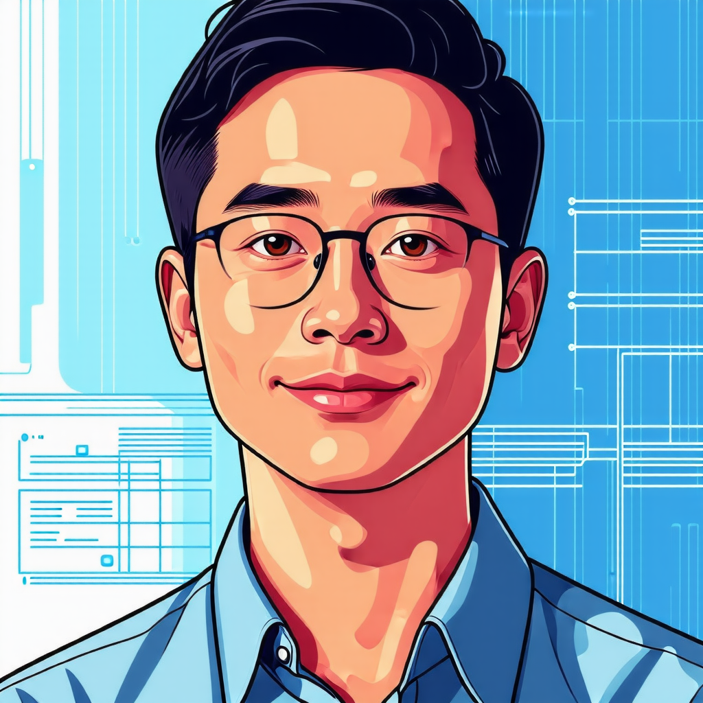
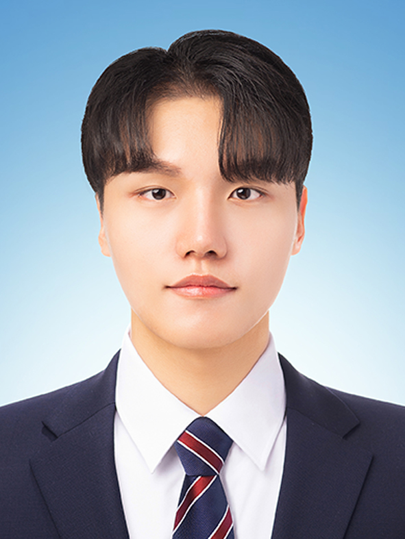
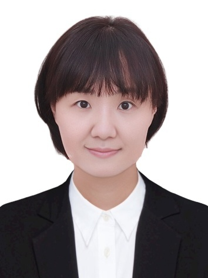
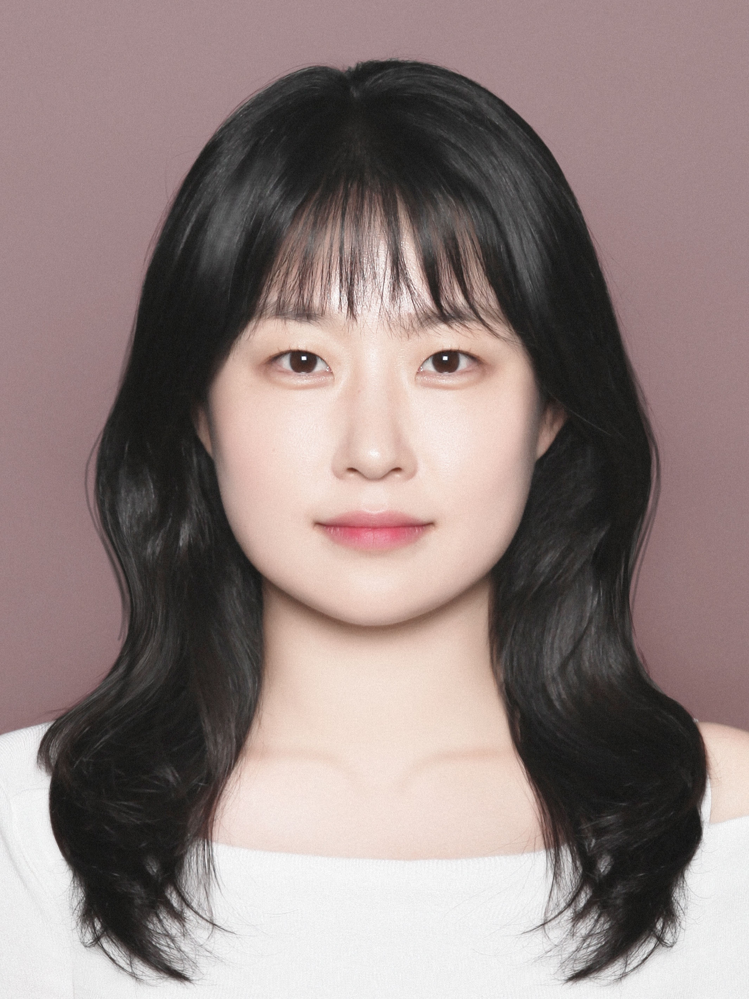
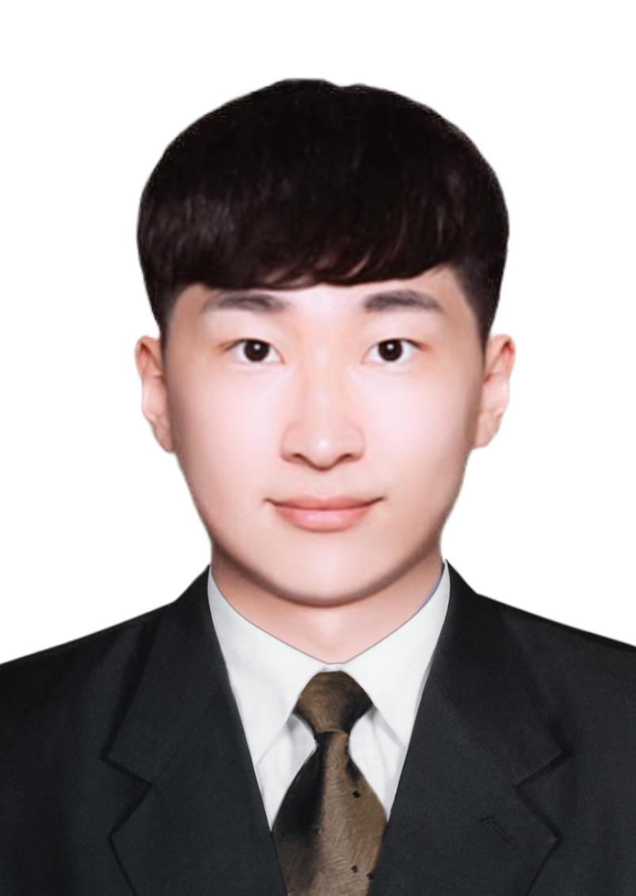
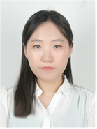
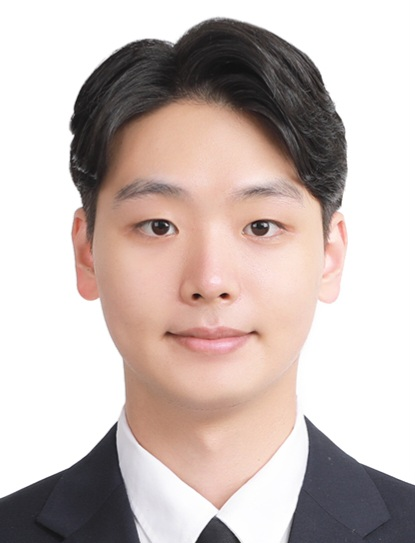

> **Info**
> - 📗: a full-time student
> - 👨‍💼or👩‍💼: a part-time student (Employed)

## PhD Course
- None

## Researchers
### Post-master researcher
- [고동현 (Donghyun Ko) 👨‍💼](#고동현-donghyun-ko-) ➡ Contract terminated in Oct. 2025

## Master Course

### Commencement in 2025
- [김효성 (Hyosung Kim) 📗](#김효성-hyosung-kim-)
- [이준희 (Edward Lee) 📗](#이준희-edward-lee-)
- [정윤석 (Yunseok Jeong) 👨‍💼](#정윤석-yunseok-jeong-)
- [이시명 (Simyung Lee) 👨‍💼](#이시명-simyung-lee-)

### Commencement in 2024
- [박계순 (Kyesun Park) 👨‍💼](#박계순-kyesun-park-)
- [권태준 (TaeJun Kwon) 📗](#권태준-taejun-kwon-)
- [이은정 (Eunjung Lee) 📗](#이은정-eunjung-lee-)
- [이현규 (Hyungyu Lee) 👨‍💼](#이현규-hyungyu-lee-)
- [장지은 (Jieun Jang) 📗](#장지은-jieun-jang-)
- [정희명 (HuiMyeong Jeong) 👨‍💼](#정희명-huimyeong-jeong-)

### Commencement in 2023
- [김은주 (JuJu Kim) 👩‍💼](#김은주-juju-kim-) ➡ Graduated in Aug. 2025, went to 한국로봇산업진흥원
- [나윤희 (Yun Hui Na)📗](#나윤희-yun-hui-na) ➡ Graduated in Aug. 2025
- [노광현 (Kwang Hyeon Ro)👨‍💼](#노광현-kwang-hyeon-ro)
- [박종민 (Jongmin Park)👨‍💼](#박종민-jongmin-park) ➡ Graduated in Aug. 2025
- 우승준 (Seung Jun Woo)👨‍💼 ➡ Graduated in Feb. 2024, went to 이음기술
- [조현우 (Hyeonwoo Cho)👨‍💼](#조현우-hyeonwoo-cho)
- [탁은영 (EunYeong Tak)📗](#탁은영-eunyeong-tak) ➡ Graduated in Aug. 2025
- 한영민 (Youngmin Han)👨‍💼 ➡ Graduated in Feb. 2024, went to 에이디엔이노텍

## 고동현 (Donghyun Ko) 👨‍💼
- 
- 관심분야: Imitation Learning

## 김효성 (Hyosung Kim) 📗
- 
- 관심분야: ROS, 멀티모달 센싱

## 이준희 (Edward Lee) 📗
- 
- 관심분야: 로봇 빅데이터, ROS

## 정윤석 (Yunseok Jeong) 👨‍💼
- 
- 관심분야: 로보틱스, 데이터사이언스
- 재직기관: 한국로봇산업진흥원

## 이시명 (Simyung Lee) 👨‍💼
- 
- 관심분야: 프로그래밍
- 재직기관: 경북대학교 해양과학연구소

## 박계순 (Kyesun Park) 👨‍💼
- 
- 관심분야: ML
- 재직기관: LS MnM

## 권태준 (TaeJun Kwon) 📗
- 
- 관심분야: 로봇 그리퍼 가상화 및 딥러닝 적용

## 이은정 (Eunjung Lee) 📗
- 
- 관심분야: 드론 촬영 영상의 OpenCV 기반 데이터 처리 및 분석

## 이현규 (Hyungyu Lee) 👨‍💼
- 
- 관심분야: 스마트 팩토리
- 재직기관: POSCO

## 장지은 (Jieun Jang) 📗
- 
- 관심분야: 터치 데이터 기반 사용자 판별법 개발

## 정희명 (HuiMyeong Jeong) 👨‍💼
- 
- 관심분야: 소셜 미디어 콘텐츠 참여도 예측을 위한 데이터 분석
- 🔗[Instagram](https://www.instagram.com/ttneck.labs/), [LinkedIn](https://www.linkedin.com/in/ttnecklabs)
- 재직기관: 대한민국 공군

## 김은주 (JuJu Kim) 👩‍💼
- 
- 관심분야: 3대산업분야의 스마트화 로봇공정 구축 및 공정관련요소 데이터분석
- 재직기관: 한국로봇산업진흥원

## 나윤희 (Yun Hui Na)📗
- 
- 관심분야: Haptics, 기술사업화

## 노광현 (Kwang Hyeon Ro)👨‍💼
- 
- 관심분야: 햅틱 기술을 활용한 소비자 행태 분석 및 UX개선
- 재직기관: NUC전자

## 박종민 (Jongmin Park)👨‍💼
- 
- 관심분야: Haptics, ML
- 🔗[LinkedIn](https://www.linkedin.com/in/jongmin-park-269426179)

## 조현우 (Hyeonwoo Cho)👨‍💼
- 
- 관심분야 : 클라우드 분야 (전환, 성과, 정책 등)

## 탁은영 (EunYeong Tak)📗
- 
- 관심분야 : Haptics, Robotics
