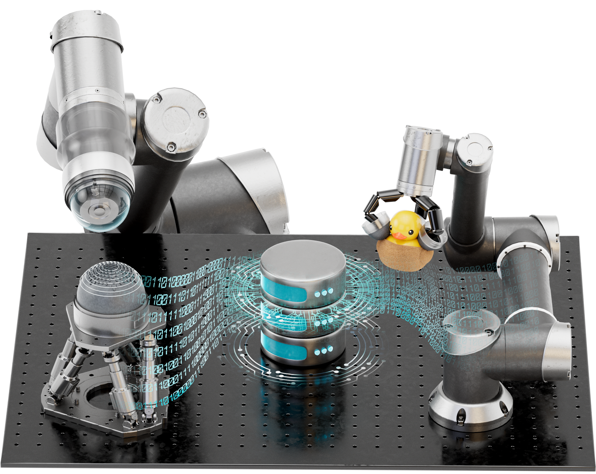

우리 연구실은
1. 로봇 핑거팁 센서의 고도화
2. 데이터드리븐 멀티모달 센싱 기술 고도화
3. 로봇 핑거팁 센서를 활용한 물체조작 기술 연구
4. 터치 빅데이터 기반 햅틱스 연구
를 메인 주제로 삼고 있습니다.

우리랩은 아래와 같은 인재를 찾고 있습니다.
- 로봇, AI에 관심이 많은데 어떻게 시작해야할 지 모르는 학생
- 빅데이터 기반의 수학적이고 객관적인 모델을 만들고 싶은 학생
- 영어 또는 논문 작성법 등의 soft skill을 높이고 싶은 학생
연구실 Open position에 관해서는 [recruitment](https://rottoda.com) 를 참고해 주세요.

<!--  -->

