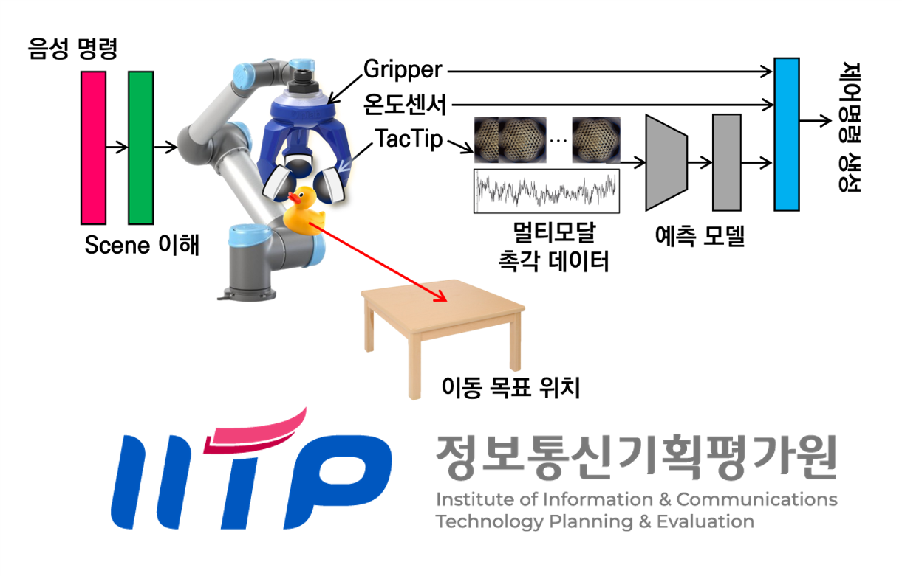

## 과제정보
- 과제명: 차세대 다중감각 통합 소셜 로봇 제어를 위한 범용 인공지능 플랫폼 개발
- 사업명: 인간지향적차세대도전형 AI기술개발 (RS-2025-02263277)
- 주관기관: 고려대학교 세종캠퍼스
- 세부과제책임자: 남세광 교수
- 과제기간
    - 1단계: 2025.04.01 - 2025.12.31
    - 2단계: 2026.01.01 - 2028.12.31
    - 3단계: 2029.01.01 - 2029.12.31

## 최종목표
- 시각, 청각, 후각, 촉각 등 다양한 감각 데이터를 통합적으로 할용한 환경 분석
- 인간과 유사한 사고 과정에 기반한 행동 계획을 수립하는 범용 인공지능 플랫폼 개발
- 로봇팔 및 소셜 로봇에 임베딩하여 성능을 실증

## 연구내용

- 위치/압력/전단력/온도/진동 검지용 촉각 센서 개발
- 접촉된 사물/표면 데이터 수집 및 처리
- 촉각 기반 물체 파지 및 이동 프레임워크 개발