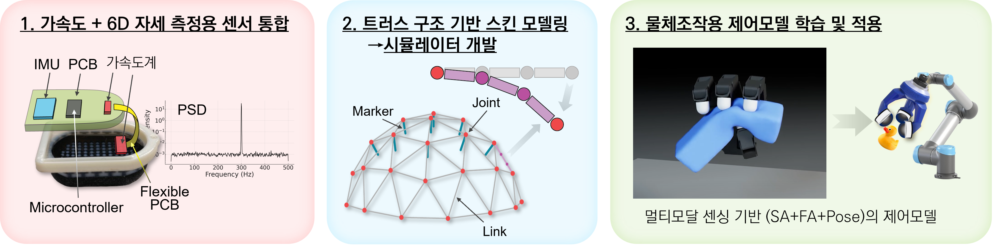

## 과제정보
- 과제명: 멀티모달 비전기반 촉각센싱에 의한 로봇의 물체 조작 기술 향상
- 사업명: 개인기초연구-글로벌 매칭형(영국) (RS-2024-00436182)
- 주관기관: 경북대학교
- 연구책임자: 남세광 교수
- 과제기간
    - 1단계: 2024.10.01 - 2027.09.30

## 최종목표
- 고감도 고유감각 로봇 촉각 센서 개발
- 촉각 센서의 시뮬레이터 개발
- 센서와 시뮬레이터를 활용하여 로봇핸드의 진일보한 물체 조작을 시연

## 연구내용

- TacTip 기반 촉각 센서의 스킨 떨림 측정 기술, 6D 자유도 자세 측정 기술 개발
- Soft structure 의 실시간 시뮬레이션이 가능한 모델 개발
- 가상 촉각 데이터를 활용한 물체 제어 학습 기술
- 가상에서 학습된 제어 모델의 현실 제어 transfer 기술